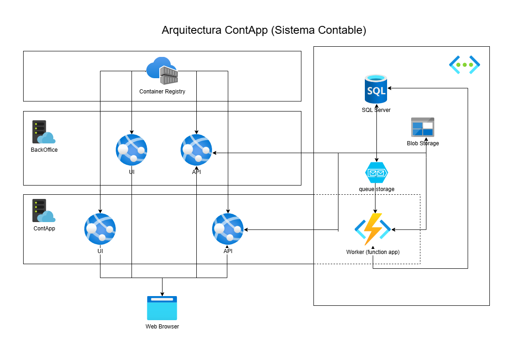

# **Proyecto Terraform – Despliegue de Arquitectura en Azure**

## **Descripción del Proyecto**

Este proyecto tiene como objetivo desplegar una arquitectura completa en **Azure** mediante **Terraform** para un sistema contable.
La infraestructura incluye recursos como **App Service Plans**, **bases de datos SQL**, **redes virtuales (VNets)** y **Storage Accounts**,
todos orquestados para brindar soporte a las aplicaciones de contabilidad en la nube.

Este trabajo se basa en la creación de un **diagrama de arquitectura** y la implementación automatizada del despliegue con Terraform,
utilizando **código parametrizado** para facilitar la reutilización.

---

## **Componentes Principales**

1. **App Service Plans**: Para alojar aplicaciones web, tanto el frontend como el backend del sistema.
2. **Azure SQL Database**: Base de datos para almacenar información contable.
3. **Azure Container Registry (ACR)**: Almacenamiento de imágenes Docker de los servicios desplegados.
4. **Virtual Network (VNet)**: Red que interconecta los servicios en entornos privados.
5. **Subnets**: Aislamiento de servicios mediante subredes.
6. **Storage Accounts**: Almacenamiento adicional para logs y archivos.
